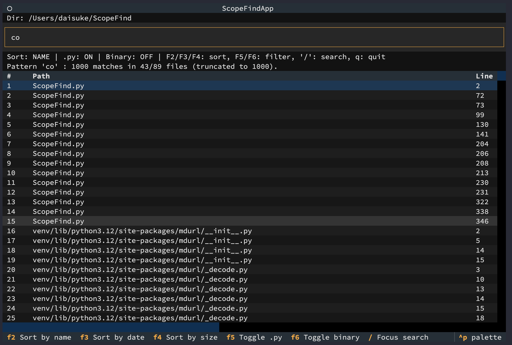
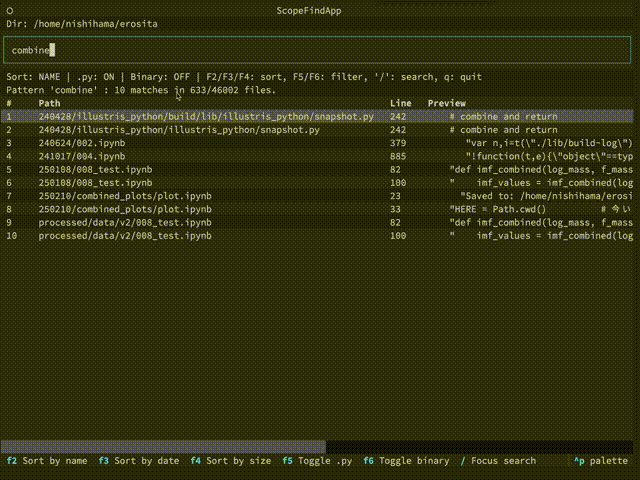

# ScopeFind


**ScopeFind** is a lightweight **TUI code search tool** built with **Python + Textual**.  
It allows incremental literal search across project files with fast filtering and navigation.

Ideal for quickly locating definitions, usages, or constants in large repositories.



We often had so much research data that we couldn’t remember where certain information was stored. To solve this, I developed a command-line tool that allows you to search with only partial information, relying on what you remember.

Since it uses a TUI instead of a GUI, it can also be used over SSH, on supercomputers, and on workstations.

## ✨ Features

- 🔍 **Incremental search** (search while typing)
- 📂 **Recursive project scanning**
- 🗂️ **Ignore common directories** such as `.git`, `__pycache__`, etc.
- 🧮 **Sort results**  
  - `F2` by *file name*
  - `F3` by *modified date*
  - `F4` by *file size*
- 🧰 **Filters**  
  - `F5` toggle `.py` search
  - `F6` toggle binary search
- 🚫 **Skips binary files** by default
- 💻 **Works in terminals** (Linux, macOS, Windows Terminal)

## 📦 Installation

From GitHub Releases (recommended):

👉 https://github.com/ddd3h/ScopeFind/releases

Download the binary for your OS:

| OS | File |
|---|---|
| Windows | `ScopeFind-windows-v{version}.exe` |
| macOS | `ScopeFind-macos-v{version}` |
| Linux | `ScopeFind-linux-v{version}` |

⚠️ Python is **not required** for the downloaded binaries.

## 🏃 Usage

To search in the current directory:

```bash
ScopeFind
```

To search in a specific directory:

```bash
ScopeFind /path/to/project
```



日本語での軽い使い方は [ScopeFindの使い方 #Linux - Qiita](https://qiita.com/ddd3h/items/ffbe4396683b2689c572) を参照してください。

## 🎹 Key Bindings

| Key                 | Action               |
| ------------------- | -------------------- |
| `/`                 | Focus search box     |
| `F2`                | Sort by name         |
| `F3`                | Sort by date         |
| `F4`                | Sort by size         |
| `F5`                | Toggle `.py` search  |
| `F6`                | Toggle binary search |
| `↑ ↓` / `PgUp PgDn` | Navigate results     |
| `q`                 | Quit                 |


## 💻 Build from Source (Developer)

Requires Python 3.10+.

```bash
pip install -r requirements.txt
python ScopeFind.py
```

### Build standalone binaries (optional):

```bash
pip install pyinstaller
pyinstaller --onefile ScopeFind.py --name ScopeFind
```

Output will appear in `dist/`.

## 🧾 License

This project is released under the **MIT License**.

© 2025 **Daisuke NISHIHAMA**


## 🙌 Contributing

Pull requests, feature ideas, and bug reports are welcome!
